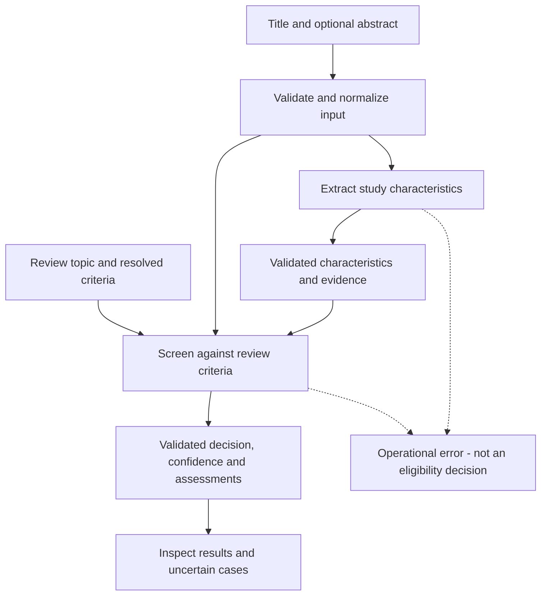

# Prompt-based screening

PUER screens titles and abstracts against explicit review criteria using two separate LLM tasks: extracting study characteristics, then deciding eligibility.
This guide explains the workflow and the information passed between stages.
The [API endpoint reference](api-endpoints.md#prompt-based-title-and-abstract-screening) is authoritative for complete request and response schemas.

## Scope and intent

The goal is conservative title-and-abstract screening with inspectable evidence, not final full-text eligibility assessment.
An `included` result retains a record at this screening stage; it does not establish that every eligibility condition has been demonstrated.
Missing or conflicting evidence must not become an unsupported exclusion.

This workflow does not use PUER's legacy embedding-based `/study_screening/encode` endpoint.

## Workflow and stage boundaries



### 1. Prepare document data and review criteria

At the API boundary, one document is a JSON object with a required nonblank `title` and an optional `abstract`.
For example, this synthetic input is sufficient for extraction:

```json
{
  "title": "Physical activity and colorectal cancer incidence",
  "abstract": "A prospective cohort examined physical activity and colorectal cancer using a hazard ratio."
}
```

Omitted, null, empty, or whitespace-only abstracts become title-only input.
Boundary whitespace is trimmed; internal source text remains unchanged so evidence quotations can be checked against it.
PMID, DOI, and known inclusion labels are not extraction or prediction request fields.
They are local identifiers and evaluation information, not model evidence.

Screening also requires a nonblank `review_topic` and nonblank, fully resolved `criteria` text.
The review owner supplies the operative inclusion and exclusion rules, including the intended cancer outcome where relevant.
`[INSERT CANCER OUTCOME]` must be replaced before screening.
Eligibility comes from the supplied criteria rather than a fixed, built-in review protocol.

The API accepts JSON requests and does not require labeled workbooks or reference inclusion labels.
Both endpoints require `X-API-Key` authentication; see [authentication](api-endpoints.md#authentication) and [environment configuration](environment-variables.md).

### 2. Extract study-level information

`POST /data_extraction/title_abstract/` receives only the title and optional abstract.
It returns `characteristics` plus server-owned `provenance`.
Extraction does not receive the review topic or criteria and does not decide inclusion.

The structured characteristics cover:

- Human-study status, publication type, and study design.
- Population, setting, sample size, and follow-up.
- Exposures, comparators, outcomes, and outcome types.
- Effect measures, confidence-interval reporting, and analysis methods.
- Source-linked evidence quotations and limitations.

Unsupported information remains null, an empty array, or `unclear`, as required by each field's schema.
For example, the synthetic abstract above does not establish a sample size or follow-up duration.
The extraction must not invent either.
Every evidence quotation must occur verbatim in its named title or abstract field.
Title-only extraction carries an explicit no-abstract limitation.

Because extraction is review-independent, its characteristics can be supplied to multiple review-specific predictions for the same document.
The service does not require the caller to extract again for each review topic.

### 3. Screen using the raw document and extracted information

`POST /study_screening/predict/` receives the original `title` and optional `abstract`, a `review_topic`, resolved `criteria`, and the extraction response's `characteristics` object.
The whole extraction response is not the `characteristics` value: its `provenance` remains separate.
Raw title and abstract text remain authoritative; extracted characteristics are advisory context, not a replacement for the source document.

The response contains:

- `decision`: `included` or `excluded`.
- `confidence`: `high`, `moderate`, or `low`.
- A concise `rationale`.
- `criterion_assessments`, with `met`, `not_met`, or `unclear` status and supporting evidence.
- `characteristic_conflicts`, describing detected disagreements with the supplied extraction.
- Server-owned `provenance`, identifying model, reasoning effort, prompt version, and schema version.

The conservative response rules are:

- Exclusion requires at least one `not_met` criterion with source evidence and cannot have low confidence.
- Any `unclear` criterion requires `included` with low confidence.
- Any disclosed material characteristic conflict requires `included` with low confidence.
- Title-only predictions cannot have high confidence.

Confidence describes evidence sufficiency and consistency, not a calibrated probability.
An API or schema failure is an operational error, not an exclusion decision.

## What the prompts do

The exact system prompts are maintained as `EXTRACTION_SYSTEM_PROMPT` and `PREDICTION_SYSTEM_PROMPT` in [the screening implementation](../inference-api/app/funcs/title_abstract_screening.py).
Their declared versions are `title-abstract-extraction-v1` and `title-abstract-screening-v1`.
The [LLM configuration reference](llm-configuration.md) owns the model and reasoning defaults.

The extraction prompt asks for supported facts only, source quotations, and concise limitations in a strict structured response.
The screening prompt asks for assessment of every operative criterion, disclosure of detected conflicts, and conservative handling of insufficient evidence.
Both treat the supplied document strings as untrusted data rather than instructions and ask for concise evidence summaries, not hidden reasoning or chain of thought.
The screening prompt also separates the document, review topic, criteria, and advisory characteristics as data.

Schema and evidence validation check response structure, verbatim quotations, and the conservative invariants above.
They do not prove that the model discovered every operative free-text criterion or every semantic conflict.
Human inspection and evaluation remain necessary.

## Interpretation and limitations

Inspect low-confidence decisions, title-only inputs, and disclosed conflicts before deciding on further assessment.
The reviewer owns the criteria, cancer outcome, decisions about further assessment, and scientific interpretation.
These endpoints do not implement full-text screening, human adjudication, batch orchestration, or benchmark evaluation.
An extraction or prediction response alone does not establish screening accuracy.
